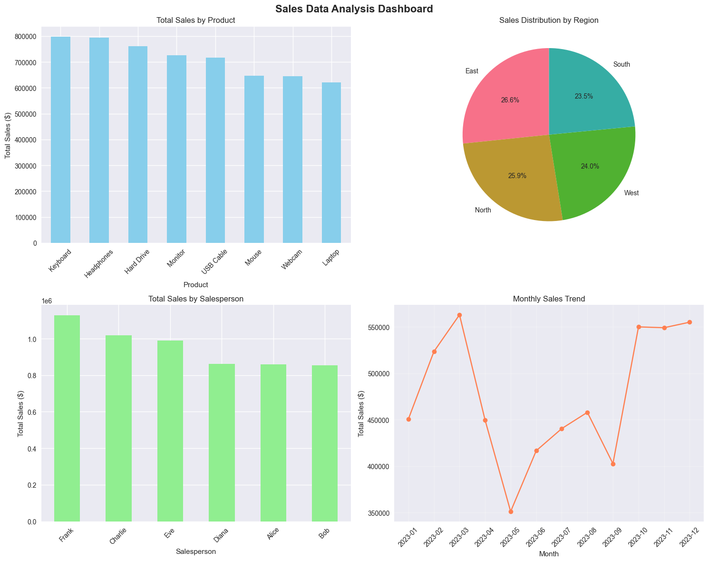

# Sales Data Analysis Project

## Overview
This project demonstrates basic data analysis using Python and Pandas on sales data. It includes data loading, cleaning, analysis, and visualization capabilities.

## Files Included
- `sales_data_analysis.ipynb`: Jupyter notebook with complete analysis
- `requirements.txt`: Python dependencies


## Features
- **Data Loading**: Load CSV files using Pandas
- **Data Cleaning**: Handle missing values and data types
- **Analysis**: Group by operations, aggregations, and calculations
- **Visualization**: Charts and graphs using Matplotlib and Seaborn
- **Insights**: Key findings and summary reports

## Quick Start

### Option 1: Using Jupyter Notebook
1. Install dependencies:
   ```bash
   pip install -r requirements.txt
   ```
2. Launch Jupyter:
   ```bash
   jupyter notebook sales_data_analysis.ipynb
   ```

### Option 2: Using Google Colab
1. Open the notebook in Google Colab
2. Upload your CSV file or use the sample data generator
3. Run all cells

### Option 3: Using VS Code
1. Install Python extension
2. Install dependencies:
   ```bash
   pip install -r requirements.txt
   ```
3. Open the notebook and run cells

## Key Analysis Sections
1. **Data Overview**: Basic dataset information
2. **Data Cleaning**: Preprocessing steps
3. **Basic Analysis**: Sales by product, region, salesperson
4. **Visualization**: Charts and graphs
5. **Advanced Analysis**: Cross-tabulations and trends
6. **Insights**: Summary of findings

## Sample Data Structure
The notebook includes a sample data generator that creates:
- 1000 sales records
- 8 different products
- 4 regions
- 6 salespeople
- Date range: Jan 2023 - Dec 2023

## Customization
To use your own CSV file:
1. Replace the sample data section with:
   ```python
   df = pd.read_csv('your_file.csv')
   ```
2. Adjust column names as needed
3. Run the analysis cells

## Output Files
- `sales_data.csv`: Original sample data
- `cleaned_sales_data.csv`: Processed data
- `sales_insights.txt`: Key insights summary
- `analysis_report.md`: Detailed analysis report
  
## Screenshot


## Dependencies
- pandas
- numpy
- matplotlib
- seaborn
- jupyter


